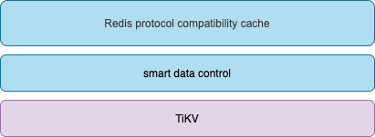
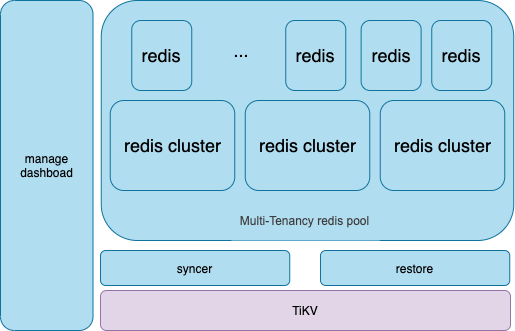

# redis on tikv

## 项目目标

借助Tikv 解决 redis 缓存持久化问题

## 现有redis持久化的弊端

* RDB 持久化采用snapshot方式，易造成数据丢失
* 无论是 RDB 还是 AOF模式都是单机持久化模式，数据不易统一管理

## redis协议+tikv产品模式的局限性

* 用户规模限制，用户需要具备一定规模才会使用该模式的产品
* 内存与SSD一个数量级的效率差距使得使用场景受限
* 现有应用资产的迁移成本
* 用户对redis使用习惯的惯性
  
## 客户无感知的持久化

* 理想的持久化模式应该是客户无感知，灾难易恢复的。

## 实现这个目标我们要做什么

* 构建符合redis协议的 Tikv Cach
* 实现 redis 协议，实现缓存，实现缓存算法，实现数据自动调度
* 这差不多要再实现一遍redis
* 时间成本，研发风险高到不可估计

## 产品实现路径长，能不能从方案入手

 盘盘我们篮子里的菜

* redissyncer，一个redis同步工具
* 能同步到redis，应该有办法存到Tikv
* 实现个redis数据结构到Tikv的映射关系
* 再实现一个从tikv解析回redis的工具
* tikv 作为持久化底座，持久化多个redis实例或集群的数据

我们希望通过这个项目沉淀出redis to tikv的数据映射关系以及持久化与逆向手段，为产品化打下基础，真正的正的产品在此基础上实现更复杂与庞大的工程，实现reids+tikv 一个真正持久化缓存系统。

## 映射关系应具备的能力

* 尽量从访问层面上兼容redis协议，尽可能广泛的兼容redis现有命令
* 能够处理redis big key
* 尽量减少描述性的数据冗余
* 遍历效率高
* 多租户

# 工程项目

* redis to tikv
  详见[https://github.com/TraceNature/redissyncer-server/blob/dev/syncer-transmission/src/test/syncer/transmission/tikv/RedisToTikvTaskTest.java] 
  测试类，只验证功能
* tikv to redis
  详见[https://github.com/TraceNature/redis_on_tikv/tree/main/restore]

